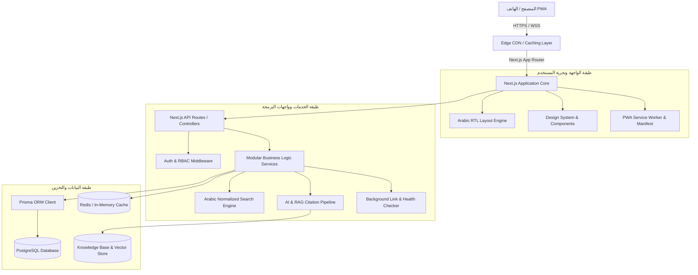

# ARCHITECTURE.md — المعمارية التقنية للمنصة
## Platform Technical Architecture & System Design

> **اسم المنصة:** دليل المقيم اليمني في السعودية (Yemeni Resident Guide — Saudi Arabia)  
> **الطراز المعماري:** Modular Full-Stack Web Application (Next.js App Router + PostgreSQL + Prisma + AI/RAG)

---

## 1. نظرة عامة على المكونات المعمارية (System Architecture Overview)



---

## 2. المكدس التقني المعتمد (Technology Stack)

### 2.1 الواجهة الأمامية (Frontend)
* **الإطار الأساسي:** `Next.js 15+` (App Router) مع `React 19` و `TypeScript`.
* **التصميم والأسلوب:** `Tailwind CSS` مُهيأ بالكامل لدعم الاتجاه من اليمين إلى اليسار (`dir="rtl"`).
* **الأيقونات والمؤثرات:** `Lucide React` للأيقونات التعبيرية و `Framer Motion` للحركات والتنقلات السلسة.
* **الخطوط:** خط عربي حديث (`Tajawal` / `Cairo`) مع أوزان متعددة مدمجة محلياً وعبر Google Fonts.
* **إمكانية الوصول والـ PWA:** دعم معايير `WCAG 2.1 AA` مع ملف `manifest.json` و `Service Workers`.

### 2.2 الواجهة الخلفية والخوادم (Backend & APIs)
* **محرك الخادم:** Next.js Route Handlers (Node.js Runtime) مع تطبيق نمط `Controller -> Service -> Repository`.
* **التحقق من البيانات (Validation):** مكتبة `Zod` للتحقق الصارم من مدخلات واجهات البرمجة والـ DTOs.
* **إدارة الجلسات والأمان:** JSON Web Tokens (JWT) مشفرة ومخزنة في `HttpOnly`, `SameSite=Strict`, `Secure` Cookies.
* **التحكم بمعدل الطلبات (Rate Limiting):** خوارزمية Token Bucket / Sliding Window للحد من هجمات الحرمان من الخدمة وهجمات القوة الغاشمة (Brute-force).

### 2.3 قاعدة البيانات وإدارة البيانات (Database & ORM)
* **المحرك:** `PostgreSQL 16+` لما يوفره من موثوقية، دعم للمعاملات الحساسة (ACID)، وفهارس البحث النصي المتقدمة (GIN / GiST).
* **طبقة الـ ORM:** `Prisma ORM` لتوفير نماذج بيانات ذات أنواع محددة مسبقاً (Type-safe Schema) مع ترحيل سلس للبيانات (Migrations).

### 2.4 محرك البحث العربي (Intelligent Search Engine)
* **معالجة النصوص العربية (Arabic Normalization):**
  - توحيد صور الألف (`أ`, `إ`, `آ` -> `ا`).
  - توحيد الياء والألف المقصورة (`ى` -> `ي`).
  - توحيد التاء المربوطة والهاء (`ة` -> `ه`).
  - إزالة التشكيل وعلامات الترقيم.
* **محرك المرادفات (Synonyms Map):** قاموس لتحويل المصطلحات الشعبية إلى المسميات الرسمية (مثل: "كفيل" -> "صاحب عمل"، "نقل كفالة" -> "نقل خدمات").
* **الترتيب والدقة (Ranking & Autocomplete):** نظام ترجيح يعتمد على مطابقة العنوان أولاً، ثم القطاع، ثم المتطلبات والكلمات المفتاحية.

### 2.5 منظومة الذكاء الاصطناعي والاسترجاع المعرفي (AI & RAG Engine)
* **نموذج اللغة:** التكامل مع واجهة LLM المتوافقة مع معايير الأمان (Gemini / OpenAI API).
* **مسار RAG الصارم:**
  ```text
  سؤال المقيم 
    → استخلاص النية (Intent Extraction)
    → استرجاع المقاطع الرسمية من قاعدة المعرفة (Knowledge Retrieval)
    → تصفية وترتيب المصادر الموثوقة (Re-ranking)
    → بناء الإجابة مع حظر الاختلاق (Constrained Generation)
    → إلحاق شارات التوثيق وروابط المصدر الرسمي وتاريخ التحقق (Source Citation)
  ```

---

## 3. هيكل المجلدات الموديولار (Modular Folder Structure)

```text
src/
├── app/                          # مسارات Next.js وتخطيط الصفحات
│   ├── (auth)/                   # صفحات تسجيل الدخول، التسجيل، واستعادة كلمة المرور
│   ├── (dashboard)/              # لوحة تحكم المقيم (المفضلات، التذكيرات، المواعيد)
│   ├── (public)/                 # الصفحات العامة (الرئيسية، القطاعات، الخدمات، الحاسبات، المكاتب)
│   │   ├── services/             # كتالوج الخدمات وصفحات تفاصيل الخدمة
│   │   ├── platforms/            # دليل المنصات الحكومية الرسمية
│   │   ├── calculators/          # حاسبات الرسوم ونقل الخدمات وتأسيس الأعمال
│   │   ├── offices/              # دليل مكاتب الخدمات والتعقيب المعتمدة
│   │   ├── articles/             # الأدلة التثقيفية والمقالات المحدثة
│   │   ├── emergency/            # أرقام الطوارئ والبلاغات الرسمية
│   │   └── legal/                # الشروط، الخصوصية، وإخلاء المسؤولية
│   ├── admin/                    # لوحة الإدارة الشاملة (للمدراء والمشرفين)
│   └── api/                      # نقاط النهاية REST API
│       ├── auth/                 # واجهات المصادقة والجلسات
│       ├── services/             # واجهات الخدمات الحكومية
│       ├── search/               # واجهات البحث المعالج عربياً
│       ├── offices/              # واجهات المكاتب والتقييمات
│       ├── ai/                   # واجهات المساعد الذكي
│       ├── admin/                # واجهات لوحة التحكم والتدقيق
│       └── health/               # واجهة فحص جاهزية النظام والخدمات
├── components/                   # المكونات المشتركة لنظام التصميم
│   ├── ui/                       # المكونات الأساسية (أزرار، حقول، بطاقات، نوافذ)
│   ├── layout/                   # الهيدر، الفوتر، والشريط السفلي للهواتف
│   ├── services/                 # مكونات تفاصيل الخدمة، الخطوات، والرسوم
│   ├── calculators/              # مكونات الحاسبات والمعالجات التفاعلية
│   └── ai/                       # واجهة المحادثة التفاعلية وشارات الاستشهاد
├── features/                     # منطق الأعمال المقسم حسب الميزات
├── lib/                          # إعدادات المكتبات (Prisma Client, Auth, AI, Logger)
├── types/                        # تعريفات TypeScript المشتركة
└── utils/                        # الدوال المساعدة (معالجة النصوص العربية، التواريخ الهجرية، التنسيق)
```

---

## 4. تدفق البيانات وتجربة المستخدم (Core UX Flow)

تتبع المنصة تدفقاً رقمياً انسيابياً:
$$\text{Search} \longrightarrow \text{Discover} \longrightarrow \text{Understand} \longrightarrow \text{Calculate} \longrightarrow \text{Prepare} \longrightarrow \text{Apply}$$

1. **البحث والاكتشاف (Search & Discover):** الوصول للخدمة في أقل من 3 نقرات من خلال الشريط الرئيسي أو التصنيفات.
2. **الفهم والاستيعاب (Understand):** قراءة الشروط، الخطوات، والفئة المستهدفة بلغة عربية سهلة وواضحة.
3. **الحساب والتخطيط (Calculate):** استخدام الحاسبات المدمجة لتقدير الرسوم والمصاريف المحتملة استناداً للمصادر الموثقة.
4. **التجهيز (Prepare):** توليد قائمة تدقيق مخصصة (Personalized Checklist) بالوثائق المطلوبة لكل حالة.
5. **التقديم المباشر (Apply):** الانتقال بنقرة واحدة عبر زر موثق شفاف إلى البوابة الحكومية الرسمية (أبشر، قوى، مقيم، مساند، بلدي).
