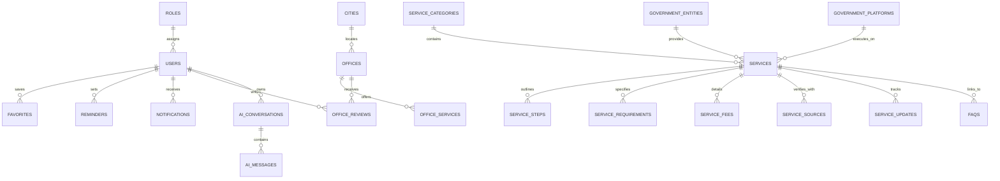

# DATABASE.md — تصميم وهندسة قاعدة البيانات
## Relational Database Schema & Data Architecture

> **المحرك:** PostgreSQL 16+  
> **طبقة الوصول للبيانات:** Prisma ORM  
> **استراتيجية الفهرسة:** B-Tree للمفاتيح الأساسية والأجنبية + GIN للبحث النصي العربي

---

## 1. مخطط الكيانات والعلاقات (Entity Relationship Diagram - ERD)

---

## 2. تفاصيل الجداول ونماذج البيانات (Data Dictionary & Models)

### 2.1 المستخدمون والأمان والتحكم بالوصول (Identity & Access Control)
* **`roles`**: أدوار النظام الثمانية (`USER`, `VERIFIED_USER`, `OFFICE_OWNER`, `OFFICE_MANAGER`, `CONTENT_EDITOR`, `CONTENT_REVIEWER`, `ADMIN`, `SUPER_ADMIN`).
* **`permissions`**: الصلاحيات الدقيقة للعمليات (`service:create`, `service:publish`, `office:verify`, إلخ).
* **`users`**:
  - `id` (UUID, PK)
  - `email` (VarChar 255, Unique, Indexed)
  - `phone` (VarChar 20, Nullable)
  - `password_hash` (VarChar 255)
  - `full_name` (VarChar 150)
  - `role_id` (FK -> roles.id)
  - `is_verified` (Boolean, Default false)
  - `created_at`, `updated_at` (Timestamps)
* **`audit_logs`**:
  - `id` (UUID, PK)
  - `user_id` (FK -> users.id, Nullable)
  - `action` (VarChar 50: `CREATE`, `UPDATE`, `DELETE`, `VERIFY`)
  - `entity_type` (VarChar 50: `SERVICE`, `FEE`, `OFFICE`)
  - `entity_id` (VarChar 100)
  - `old_values` (JSONB)
  - `new_values` (JSONB)
  - `ip_address` (VarChar 45)
  - `user_agent` (Text)
  - `created_at` (Timestamp)

### 2.2 كتالوج الخدمات الحكومية (Government Services Catalog)
* **`service_categories`**:
  - `id` (UUID, PK), `slug` (Unique), `name_ar`, `name_en`, `icon`, `sort_order`, `is_active`
* **`government_entities`**:
  - `id` (UUID, PK), `name_ar`, `name_en`, `acronym`, `official_website`, `logo_url`
* **`government_platforms`**:
  - `id` (UUID, PK), `slug` (Unique), `name_ar`, `name_en`, `logo_url`, `url`, `description_ar`, `entity_id` (FK)
* **`services`**:
  - `id` (UUID, PK)
  - `slug` (VarChar 150, Unique, Indexed)
  - `name_ar` (VarChar 255, Indexed)
  - `name_en` (VarChar 255)
  - `description_ar` (Text)
  - `description_en` (Text, Nullable)
  - `category_id` (FK -> service_categories.id)
  - `entity_id` (FK -> government_entities.id)
  - `platform_id` (FK -> government_platforms.id)
  - `target_audience` (VarChar 100: `RESIDENTS`, `ESTABLISHMENTS`, `FAMILIES`, `DOMESTIC_WORKERS`)
  - `processing_time` (VarChar 100)
  - `status` (Enum: `DRAFT`, `UNDER_REVIEW`, `VERIFIED`, `PUBLISHED`, `OUTDATED`, `ARCHIVED`)
  - `verification_status` (Enum: `VERIFIED`, `RECENTLY_VERIFIED`, `NEEDS_REVIEW`, `OUTDATED`)
  - `featured` (Boolean, Default false)
  - `view_count` (Integer, Default 0)
  - `last_verified_at` (Timestamp)
  - `created_at`, `updated_at` (Timestamps)
* **`service_steps`**:
  - `id` (UUID, PK), `service_id` (FK), `step_number` (Int), `title_ar`, `description_ar`
* **`service_requirements`**:
  - `id` (UUID, PK), `service_id` (FK), `title_ar`, `is_mandatory` (Boolean), `conditional_clause` (Text, Nullable)
* **`service_fees`**:
  - `id` (UUID, PK), `service_id` (FK), `fee_type` (Enum: `OFFICIAL_GOVERNMENT`, `OFFICE_ESTIMATED`, `ADDITIONAL`), `amount` (Decimal 10,2), `currency` (Default 'SAR'), `duration_unit` (Nullable: 'YEAR', 'MONTH'), `notes_ar`, `effective_from`, `effective_to`
* **`service_sources`**:
  - `id` (UUID, PK), `service_id` (FK), `source_url` (Text), `source_name` (VarChar 200), `source_type` (Enum: `GOV_PORTAL`, `OFFICIAL_PDF`, `GAZETTE`, `CIRCULAR`), `confidence` (Enum: `HIGH`, `MEDIUM`, `LOW`), `last_checked_at`, `status_code` (Int: 200, 404, etc.)
* **`service_updates`**:
  - `id` (UUID, PK), `service_id` (FK), `title_ar`, `summary_ar`, `source_url`, `published_at`

### 2.3 دليل المكاتب والتقييمات (Offices & Reviews Directory)
* **`cities`**:
  - `id` (UUID, PK), `name_ar`, `name_en`, `region_ar`, `sort_order`
* **`offices`**:
  - `id` (UUID, PK)
  - `name_ar` (VarChar 255)
  - `city_id` (FK -> cities.id)
  - `district_ar` (VarChar 150)
  - `phone` (VarChar 20)
  - `whatsapp` (VarChar 20)
  - `commercial_reg_no` (VarChar 50, Nullable)
  - `license_status` (Enum: `VERIFIED`, `UNVERIFIED`, `PENDING_REVIEW`)
  - `status` (Enum: `PENDING`, `APPROVED`, `REJECTED`, `SUSPENDED`)
  - `rating_average` (Decimal 3,2, Default 0.0)
  - `reviews_count` (Integer, Default 0)
  - `created_at`, `updated_at` (Timestamps)
* **`office_reviews`**:
  - `id` (UUID, PK), `office_id` (FK), `user_id` (FK), `rating` (SmallInt: 1-5), `comment` (Text), `service_type` (VarChar 100), `is_approved` (Boolean, Default false), `created_at` (Timestamp)

### 2.4 لوحة المقيم والتذكيرات والمساعد الذكي (Resident Features & AI)
* **`favorites`**: `id`, `user_id` (FK), `service_id` (FK), `created_at`
* **`reminders`**: `id`, `user_id` (FK), `title_ar`, `reminder_type` (Enum: `IQAMA_EXPIRY`, `PASSPORT_EXPIRY`, `INSURANCE_EXPIRY`, `APPOINTMENT`), `due_date` (Date), `is_completed` (Boolean), `created_at`
* **`notifications`**: `id`, `user_id` (FK), `title`, `body`, `link`, `is_read` (Boolean), `created_at`
* **`ai_conversations`**: `id`, `user_id` (FK, Nullable), `session_token` (VarChar 100), `created_at`
* **`ai_messages`**: `id`, `conversation_id` (FK), `role` (Enum: `USER`, `ASSISTANT`, `SYSTEM`), `content` (Text), `sources_cited` (JSONB), `confidence_score` (Decimal 3,2), `created_at`
* **`faqs`**: `id`, `category_id` (FK, Nullable), `service_id` (FK, Nullable), `question_ar`, `answer_ar`, `source_url`
* **`articles`**: `id`, `slug` (Unique), `title_ar`, `content_ar`, `category_id` (FK), `published_at`, `is_published`

---

## 3. الفهارس وتحسين الأداء (Indexes & Performance)
1. **فهارس المفاتيح الفريدة:**
   - `services.slug`, `service_categories.slug`, `government_platforms.slug`, `articles.slug`.
2. **فهارس العلاقات (Foreign Key Indexes):**
   - فهرسة جميع الحقول المرتبطة (`service_id`, `category_id`, `user_id`, `city_id`) لتسريع عمليات الـ JOIN.
3. **فهارس البحث النصي العربي (GIN Trigram Index):**
   - إنشاء ملحق `pg_trgm` وفهرس GIN على حقول `services(name_ar, description_ar)` لتمكين البحث الضبابي والسريع.

---

## 4. خطة الترحيل وبذر البيانات (Migrations & Seeding Plan)
* **المرحلة 1:** تفعيل الـ Migrations عبر `npx prisma migrate dev --name init`.
* **المرحلة 2:** تشغيل سكربت البذر `seed.ts` لإدخال:
  - الأدوار الأساسية والصلاحيات.
  - حساب مسؤول النظام المشرف (`SUPER_ADMIN`).
  - القطاعات الـ 12 الأساسية والمدن الرئيسية في المملكة.
  - المنصات الحكومية الرسمية (أبشر، مقيم، قوى، مدد، مساند، بلدي، سلامة، وغيرها).
  - الخدمات الموثقة الأساسية وتصنيف رسومها المعتمدة مع توثيق المصادر وروابطها.
